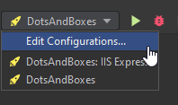
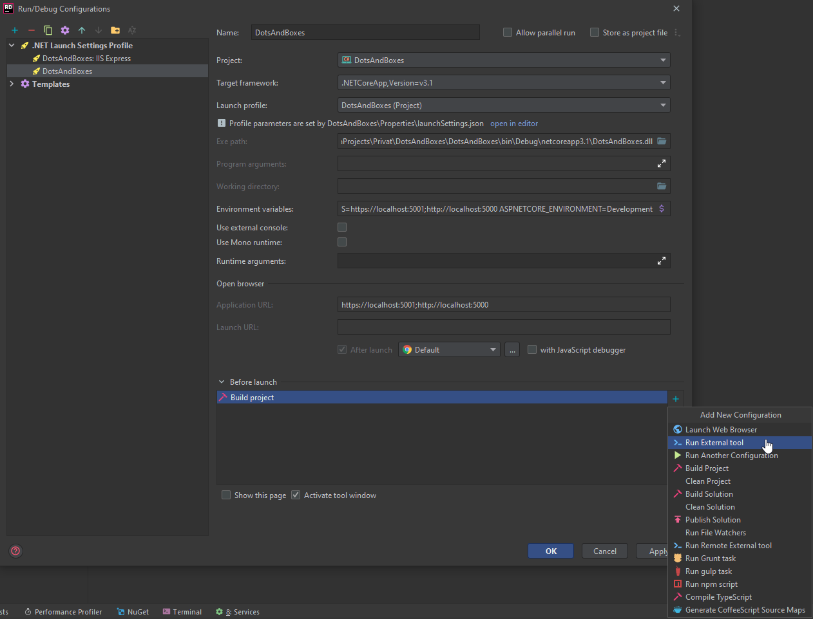
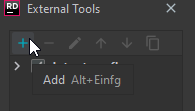
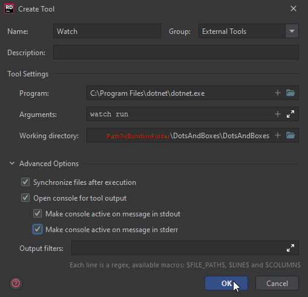

# DotsAndBoxes

## Cloning
* Clone Project
* delete .git folder
* delete .img folder
* delete README.md
* (remove VCS Root from Rider)
* Clone [API](https://github.com/TheSwerik/DotsAndBoxes-API) into the API folder
* Clone [UI](https://github.com/TheSwerik/DotsAndBoxes-UI) into the UI folder

## Activating hot-reload:
### Quick manual
* open terminal
* `cd DotsAndBoxes`
* `dotnet watch run`
### Slow Automatic

then just pres "ok" a few times.
